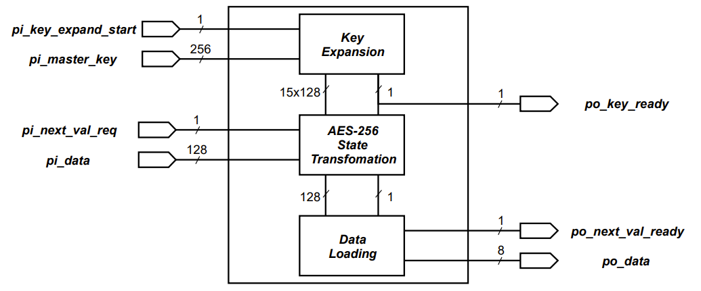
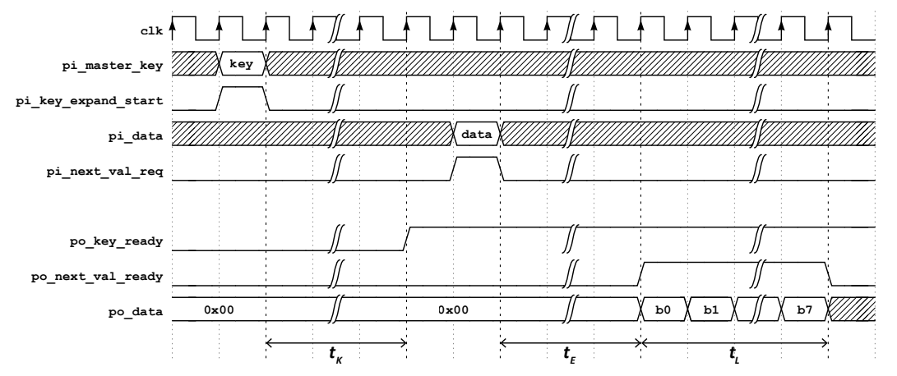

# AES-256 Hardware Design  

**Description:**

VHDL hardware design of the AES-256 encryption algorithm for ASIC or FPGA implementation with SystemVerilog testbench

AES-256 is implemented as a two-part design - *key expansion* (`key_expansion_top.vhd`) and *encryption* (`encryption_top.vhd`). The 128-bit ciphertext is then taken by *data loading* (`data_loading.vhd`) block and sent down an 8-bit bus in 16 packets. Those three modules are instantiated in the design top `aes256_loading.vhd`

Testbench is implemented in a single SystemVerilog file `aes256_loading_tb.sv`. Python scripts (`checker_gen.py` and `test_gen.py`) are used to generate reference input (key and plaintext) and output (ciphertext) vectors. Input vectors are then used by the testbench to drive the DUT while output vectors are used in the checker.

**Status:**  
Basic functional verification is done with with 100 different keys and a 1000 different plaintext-ciphertext pairs for each key

**Further development:**  
Additional test cases  
Functional and code coverage

## Top level I/O and internal blocks

## Timing diagram - Top level

